```mermaid
flowchart TB
    subgraph upstream["Dependants (2)"]
        P3["<b>📦&nbsp;WebSpark.ArtSpark.Demo.csproj</b><br/><small>net9.0</small>"]
        P5["<b>📦&nbsp;WebSpark.ArtSpark.Tests.csproj</b><br/><small>net9.0</small>"]
        click P3 "#websparkartsparkdemowebsparkartsparkdemocsproj"
        click P5 "#websparkartsparktestswebsparkartsparktestscsproj"
    end
    subgraph current["WebSpark.ArtSpark.Agent.csproj"]
        MAIN["<b>📦&nbsp;WebSpark.ArtSpark.Agent.csproj</b><br/><small>net9.0</small>"]
        click MAIN "#websparkartsparkagentwebsparkartsparkagentcsproj"
    end
    P3 --> MAIN
    P5 --> MAIN

```

```mermaid
flowchart TB
    subgraph upstream["Dependants (2)"]
        P1["<b>📦&nbsp;WebSpark.ArtSpark.Console.csproj</b><br/><small>net9.0</small>"]
        P3["<b>📦&nbsp;WebSpark.ArtSpark.Demo.csproj</b><br/><small>net9.0</small>"]
        click P1 "#websparkartsparkconsolewebsparkartsparkconsolecsproj"
        click P3 "#websparkartsparkdemowebsparkartsparkdemocsproj"
    end
    subgraph current["WebSpark.ArtSpark.Client.csproj"]
        MAIN["<b>📦&nbsp;WebSpark.ArtSpark.Client.csproj</b><br/><small>net9.0</small>"]
        click MAIN "#websparkartsparkclientwebsparkartsparkclientcsproj"
    end
    P1 --> MAIN
    P3 --> MAIN

```

```mermaid
flowchart TB
    subgraph current["WebSpark.ArtSpark.Console.csproj"]
        MAIN["<b>📦&nbsp;WebSpark.ArtSpark.Console.csproj</b><br/><small>net9.0</small>"]
        click MAIN "#websparkartsparkconsolewebsparkartsparkconsolecsproj"
    end
    subgraph downstream["Dependencies (1"]
        P2["<b>📦&nbsp;WebSpark.ArtSpark.Client.csproj</b><br/><small>net9.0</small>"]
        click P2 "#websparkartsparkclientwebsparkartsparkclientcsproj"
    end
    MAIN --> P2

```

```mermaid
flowchart TB
    subgraph upstream["Dependants (1)"]
        P5["<b>📦&nbsp;WebSpark.ArtSpark.Tests.csproj</b><br/><small>net9.0</small>"]
        click P5 "#websparkartsparktestswebsparkartsparktestscsproj"
    end
    subgraph current["WebSpark.ArtSpark.Demo.csproj"]
        MAIN["<b>📦&nbsp;WebSpark.ArtSpark.Demo.csproj</b><br/><small>net9.0</small>"]
        click MAIN "#websparkartsparkdemowebsparkartsparkdemocsproj"
    end
    subgraph downstream["Dependencies (2"]
        P2["<b>📦&nbsp;WebSpark.ArtSpark.Client.csproj</b><br/><small>net9.0</small>"]
        P4["<b>📦&nbsp;WebSpark.ArtSpark.Agent.csproj</b><br/><small>net9.0</small>"]
        click P2 "#websparkartsparkclientwebsparkartsparkclientcsproj"
        click P4 "#websparkartsparkagentwebsparkartsparkagentcsproj"
    end
    P5 --> MAIN
    MAIN --> P2
    MAIN --> P4

```

# Projects and dependencies analysis

This document provides a comprehensive overview of the projects and their dependencies in the context of upgrading to .NET 9.0.

## Table of Contents

- [Projects Relationship Graph](#projects-relationship-graph)
- [Project Details](#project-details)

  - [WebSpark.ArtSpark.Agent\WebSpark.ArtSpark.Agent.csproj](#websparkartsparkagentwebsparkartsparkagentcsproj)
  - [WebSpark.ArtSpark.Client\WebSpark.ArtSpark.Client.csproj](#websparkartsparkclientwebsparkartsparkclientcsproj)
  - [WebSpark.ArtSpark.Console\WebSpark.ArtSpark.Console.csproj](#websparkartsparkconsolewebsparkartsparkconsolecsproj)
  - [WebSpark.ArtSpark.Demo\WebSpark.ArtSpark.Demo.csproj](#websparkartsparkdemowebsparkartsparkdemocsproj)
  - [WebSpark.ArtSpark.Tests\WebSpark.ArtSpark.Tests.csproj](#websparkartsparktestswebsparkartsparktestscsproj)
- [Aggregate NuGet packages details](#aggregate-nuget-packages-details)

## Projects Relationship Graph

Legend:
📦 SDK-style project
⚙️ Classic project

## Project Details

### WebSpark.ArtSpark.Agent\WebSpark.ArtSpark.Agent.csproj

#### Project Info

- **Current Target Framework:** net9.0
- **Proposed Target Framework:** net10.0
- **SDK-style**: True
- **Project Kind:** ClassLibrary
- **Dependencies**: 0
- **Dependants**: 2
- **Number of Files**: 35
- **Lines of Code**: 2895

#### Dependency Graph

Legend:
📦 SDK-style project
⚙️ Classic project

#### Project Package References

| Package | Type | Current Version | Suggested Version | Description |
| :--- | :---: | :---: | :---: | :--- |
| Microsoft.Extensions.Configuration.Abstractions | Explicit | 10.0.0 |  | ✅Compatible |
| Microsoft.Extensions.Hosting | Explicit | 10.0.0 |  | ✅Compatible |
| Microsoft.Extensions.Http | Explicit | 10.0.0 |  | ✅Compatible |
| Microsoft.Extensions.Options | Explicit | 10.0.0 |  | ✅Compatible |
| Microsoft.SemanticKernel | Explicit | 1.67.1 |  | ✅Compatible |
| Microsoft.SemanticKernel.Connectors.OpenAI | Explicit | 1.67.1 |  | ✅Compatible |
| WebSpark.HttpClientUtility | Explicit | 2.1.1 |  | ✅Compatible |

### WebSpark.ArtSpark.Client\WebSpark.ArtSpark.Client.csproj

#### Project Info

- **Current Target Framework:** net9.0
- **Proposed Target Framework:** net10.0
- **SDK-style**: True
- **Project Kind:** ClassLibrary
- **Dependencies**: 0
- **Dependants**: 2
- **Number of Files**: 27
- **Lines of Code**: 2940

#### Dependency Graph

Legend:
📦 SDK-style project
⚙️ Classic project

#### Project Package References

| Package | Type | Current Version | Suggested Version | Description |
| :--- | :---: | :---: | :---: | :--- |
| Microsoft.AspNet.WebApi.Client | Explicit | 6.0.0 |  | ✅Compatible |
| WebSpark.HttpClientUtility | Explicit | 2.1.1 |  | ✅Compatible |

### WebSpark.ArtSpark.Console\WebSpark.ArtSpark.Console.csproj

#### Project Info

- **Current Target Framework:** net9.0
- **Proposed Target Framework:** net10.0
- **SDK-style**: True
- **Project Kind:** DotNetCoreApp
- **Dependencies**: 1
- **Dependants**: 0
- **Number of Files**: 4
- **Lines of Code**: 267

#### Dependency Graph

Legend:
📦 SDK-style project
⚙️ Classic project

#### Project Package References

| Package | Type | Current Version | Suggested Version | Description |
| :--- | :---: | :---: | :---: | :--- |
| Microsoft.AspNet.WebApi.Client | Explicit | 6.0.0 |  | ✅Compatible |
| Microsoft.Extensions.Configuration.Json | Explicit | 9.0.6 | 10.0.0 | NuGet package upgrade is recommended |
| Microsoft.Extensions.Logging.Console | Explicit | 9.0.6 | 10.0.0 | NuGet package upgrade is recommended |
| WebSpark.HttpClientUtility | Explicit | 1.1.0 |  | ✅Compatible |

### WebSpark.ArtSpark.Demo\WebSpark.ArtSpark.Demo.csproj

#### Project Info

- **Current Target Framework:** net9.0
- **Proposed Target Framework:** net10.0
- **SDK-style**: True
- **Project Kind:** AspNetCore
- **Dependencies**: 2
- **Dependants**: 1
- **Number of Files**: 114
- **Lines of Code**: 20713

#### Dependency Graph

Legend:
📦 SDK-style project
⚙️ Classic project

#### Project Package References

| Package | Type | Current Version | Suggested Version | Description |
| :--- | :---: | :---: | :---: | :--- |
| Markdig | Explicit | 0.41.3 |  | ✅Compatible |
| Microsoft.AspNetCore.Identity.EntityFrameworkCore | Explicit | 9.0.6 | 10.0.0 | NuGet package upgrade is recommended |
| Microsoft.EntityFrameworkCore.InMemory | Explicit | 9.0.6 | 10.0.0 | NuGet package upgrade is recommended |
| Microsoft.EntityFrameworkCore.Sqlite | Explicit | 9.0.6 | 10.0.0 | NuGet package upgrade is recommended |
| Microsoft.EntityFrameworkCore.Tools | Explicit | 9.0.6 | 10.0.0 | NuGet package upgrade is recommended |
| Serilog | Explicit | 4.3.0 |  | ✅Compatible |
| Serilog.Extensions.Hosting | Explicit | 9.0.0 |  | ✅Compatible |
| Serilog.Settings.Configuration | Explicit | 9.0.0 |  | ✅Compatible |
| Serilog.Sinks.Console | Explicit | 6.0.0 |  | ✅Compatible |
| Serilog.Sinks.File | Explicit | 7.0.0 |  | ✅Compatible |
| WebSpark.Bootswatch | Explicit | 1.20.1 |  | ✅Compatible |
| WebSpark.HttpClientUtility | Explicit | 1.1.0 |  | ✅Compatible |

### WebSpark.ArtSpark.Tests\WebSpark.ArtSpark.Tests.csproj

#### Project Info

- **Current Target Framework:** net9.0
- **Proposed Target Framework:** net10.0
- **SDK-style**: True
- **Project Kind:** DotNetCoreApp
- **Dependencies**: 2
- **Dependants**: 0
- **Number of Files**: 5
- **Lines of Code**: 368

#### Dependency Graph

Legend:
📦 SDK-style project
⚙️ Classic project

#### Project Package References

| Package | Type | Current Version | Suggested Version | Description |
| :--- | :---: | :---: | :---: | :--- |
| coverlet.collector | Explicit | 6.0.4 |  | ✅Compatible |
| Microsoft.AspNetCore.Mvc.Testing | Explicit | 9.0.6 | 10.0.0 | NuGet package upgrade is recommended |
| Microsoft.Extensions.Configuration | Explicit | 9.0.6 | 10.0.0 | NuGet package upgrade is recommended |
| Microsoft.Extensions.DependencyInjection | Explicit | 9.0.6 | 10.0.0 | NuGet package upgrade is recommended |
| Microsoft.Extensions.Hosting | Explicit | 9.0.6 | 10.0.0 | NuGet package upgrade is recommended |
| Microsoft.Extensions.Logging | Explicit | 9.0.6 | 10.0.0 | NuGet package upgrade is recommended |
| Microsoft.NET.Test.Sdk | Explicit | 17.14.1 |  | ✅Compatible |
| Moq | Explicit | 4.20.72 |  | ✅Compatible |
| xunit | Explicit | 2.9.3 |  | ✅Compatible |
| xunit.runner.visualstudio | Explicit | 3.1.1 |  | ✅Compatible |

## Aggregate NuGet packages details

| Package | Current Version | Suggested Version | Projects | Description |
| :--- | :---: | :---: | :--- | :--- |
| coverlet.collector | 6.0.4 |  | [WebSpark.ArtSpark.Tests.csproj](#websparkartsparktestscsproj) | ✅Compatible |
| Markdig | 0.41.3 |  | [WebSpark.ArtSpark.Demo.csproj](#websparkartsparkdemocsproj) | ✅Compatible |
| Microsoft.AspNet.WebApi.Client | 6.0.0 |  | [WebSpark.ArtSpark.Client.csproj](#websparkartsparkclientcsproj) [WebSpark.ArtSpark.Console.csproj](#websparkartsparkconsolecsproj) | ✅Compatible |
| Microsoft.AspNetCore.Identity.EntityFrameworkCore | 9.0.6 | 10.0.0 | [WebSpark.ArtSpark.Demo.csproj](#websparkartsparkdemocsproj) | NuGet package upgrade is recommended |
| Microsoft.AspNetCore.Mvc.Testing | 9.0.6 | 10.0.0 | [WebSpark.ArtSpark.Tests.csproj](#websparkartsparktestscsproj) | NuGet package upgrade is recommended |
| Microsoft.EntityFrameworkCore.InMemory | 9.0.6 | 10.0.0 | [WebSpark.ArtSpark.Demo.csproj](#websparkartsparkdemocsproj) | NuGet package upgrade is recommended |
| Microsoft.EntityFrameworkCore.Sqlite | 9.0.6 | 10.0.0 | [WebSpark.ArtSpark.Demo.csproj](#websparkartsparkdemocsproj) | NuGet package upgrade is recommended |
| Microsoft.EntityFrameworkCore.Tools | 9.0.6 | 10.0.0 | [WebSpark.ArtSpark.Demo.csproj](#websparkartsparkdemocsproj) | NuGet package upgrade is recommended |
| Microsoft.Extensions.Configuration | 9.0.6 | 10.0.0 | [WebSpark.ArtSpark.Tests.csproj](#websparkartsparktestscsproj) | NuGet package upgrade is recommended |
| Microsoft.Extensions.Configuration.Abstractions | 10.0.0 |  | [WebSpark.ArtSpark.Agent.csproj](#websparkartsparkagentcsproj) | ✅Compatible |
| Microsoft.Extensions.Configuration.Json | 9.0.6 | 10.0.0 | [WebSpark.ArtSpark.Console.csproj](#websparkartsparkconsolecsproj) | NuGet package upgrade is recommended |
| Microsoft.Extensions.DependencyInjection | 9.0.6 | 10.0.0 | [WebSpark.ArtSpark.Tests.csproj](#websparkartsparktestscsproj) | NuGet package upgrade is recommended |
| Microsoft.Extensions.Hosting | 10.0.0 |  | [WebSpark.ArtSpark.Agent.csproj](#websparkartsparkagentcsproj) | ✅Compatible |
| Microsoft.Extensions.Hosting | 9.0.6 | 10.0.0 | [WebSpark.ArtSpark.Tests.csproj](#websparkartsparktestscsproj) | NuGet package upgrade is recommended |
| Microsoft.Extensions.Http | 10.0.0 |  | [WebSpark.ArtSpark.Agent.csproj](#websparkartsparkagentcsproj) | ✅Compatible |
| Microsoft.Extensions.Logging | 9.0.6 | 10.0.0 | [WebSpark.ArtSpark.Tests.csproj](#websparkartsparktestscsproj) | NuGet package upgrade is recommended |
| Microsoft.Extensions.Logging.Console | 9.0.6 | 10.0.0 | [WebSpark.ArtSpark.Console.csproj](#websparkartsparkconsolecsproj) | NuGet package upgrade is recommended |
| Microsoft.Extensions.Options | 10.0.0 |  | [WebSpark.ArtSpark.Agent.csproj](#websparkartsparkagentcsproj) | ✅Compatible |
| Microsoft.NET.Test.Sdk | 17.14.1 |  | [WebSpark.ArtSpark.Tests.csproj](#websparkartsparktestscsproj) | ✅Compatible |
| Microsoft.SemanticKernel | 1.67.1 |  | [WebSpark.ArtSpark.Agent.csproj](#websparkartsparkagentcsproj) | ✅Compatible |
| Microsoft.SemanticKernel.Connectors.OpenAI | 1.67.1 |  | [WebSpark.ArtSpark.Agent.csproj](#websparkartsparkagentcsproj) | ✅Compatible |
| Moq | 4.20.72 |  | [WebSpark.ArtSpark.Tests.csproj](#websparkartsparktestscsproj) | ✅Compatible |
| Serilog | 4.3.0 |  | [WebSpark.ArtSpark.Demo.csproj](#websparkartsparkdemocsproj) | ✅Compatible |
| Serilog.Extensions.Hosting | 9.0.0 |  | [WebSpark.ArtSpark.Demo.csproj](#websparkartsparkdemocsproj) | ✅Compatible |
| Serilog.Settings.Configuration | 9.0.0 |  | [WebSpark.ArtSpark.Demo.csproj](#websparkartsparkdemocsproj) | ✅Compatible |
| Serilog.Sinks.Console | 6.0.0 |  | [WebSpark.ArtSpark.Demo.csproj](#websparkartsparkdemocsproj) | ✅Compatible |
| Serilog.Sinks.File | 7.0.0 |  | [WebSpark.ArtSpark.Demo.csproj](#websparkartsparkdemocsproj) | ✅Compatible |
| WebSpark.Bootswatch | 1.20.1 |  | [WebSpark.ArtSpark.Demo.csproj](#websparkartsparkdemocsproj) | ✅Compatible |
| WebSpark.HttpClientUtility | 1.1.0 |  | [WebSpark.ArtSpark.Console.csproj](#websparkartsparkconsolecsproj) [WebSpark.ArtSpark.Demo.csproj](#websparkartsparkdemocsproj) | ✅Compatible |
| WebSpark.HttpClientUtility | 2.1.1 |  | [WebSpark.ArtSpark.Agent.csproj](#websparkartsparkagentcsproj) [WebSpark.ArtSpark.Client.csproj](#websparkartsparkclientcsproj) | ✅Compatible |
| xunit | 2.9.3 |  | [WebSpark.ArtSpark.Tests.csproj](#websparkartsparktestscsproj) | ✅Compatible |
| xunit.runner.visualstudio | 3.1.1 |  | [WebSpark.ArtSpark.Tests.csproj](#websparkartsparktestscsproj) | ✅Compatible |

